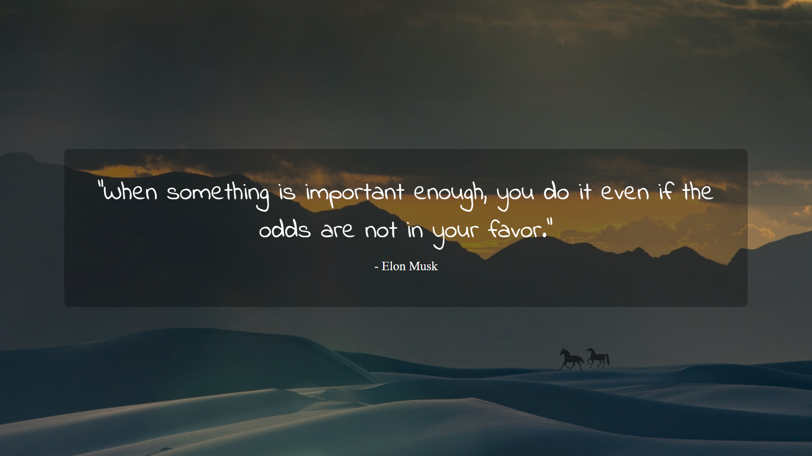

# Daily Dose of Quotes 🌟

Welcome to **Daily Dose of Quotes**, where a positive mindset is the key to unlocking unlimited potential! 🚀

## About
This repository houses the code for a web application that provides you with a daily dose of inspirational quotes. Embrace the positivity and let these quotes motivate you throughout your day.

## Features
- Dynamic loading of random quotes.
- Beautiful background images from Unsplash.
- Toggle background music for a soothing experience.

## Usage
1. Open `index.html` in your web browser.
2. Enjoy the uplifting quotes along with visually appealing background images.
3. Toggle the background music on/off with the sound icon button.

- Alternatively, view the website on [GitHub Pages](https://thestrange-007.github.io/Daily-Dose-Of-Quotes/).

## Customize Your Experience
- Add query parameters to the URL for a personalized experience:
  - `tag`: Filter quotes by a specific tag.
  - `author`: Get quotes from a specific author.

Example: `index.html?tag=motivation&author=Einstein`

## Technologies Used
- HTML
- CSS
- JavaScript

## Credits
- [Quotable API](https://api.quotable.io/) for providing inspiring quotes.
- [Unsplash](https://unsplash.com/) for the stunning background images.

## License
This project is licensed under the [MIT License](LICENSE).